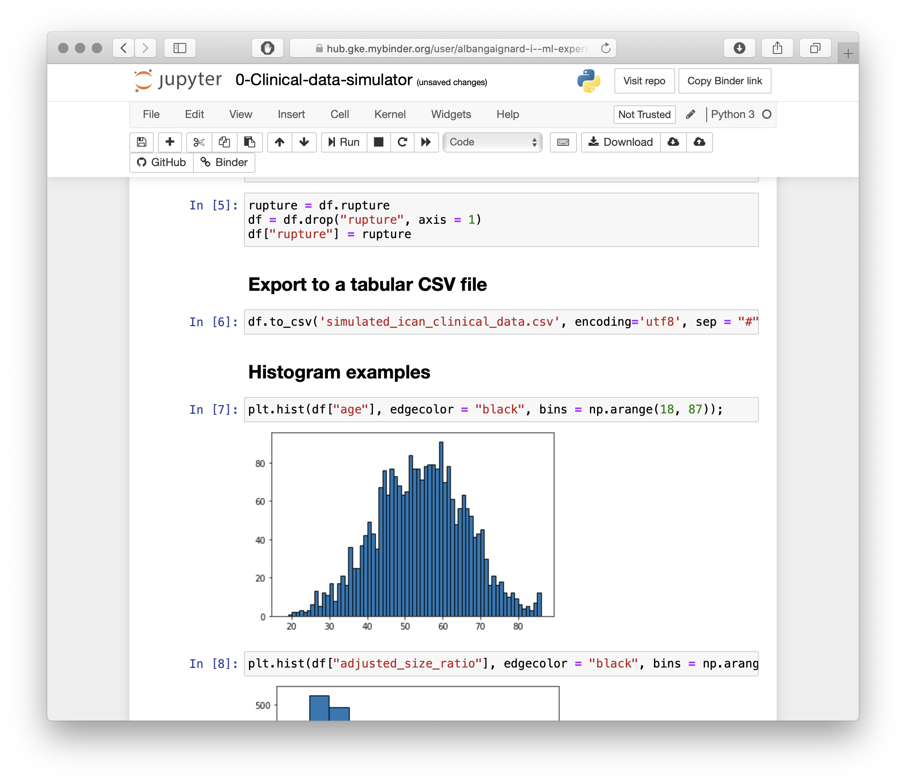
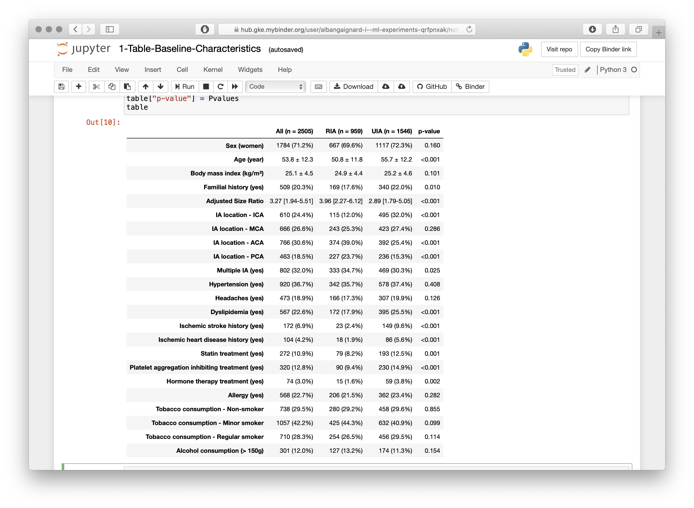
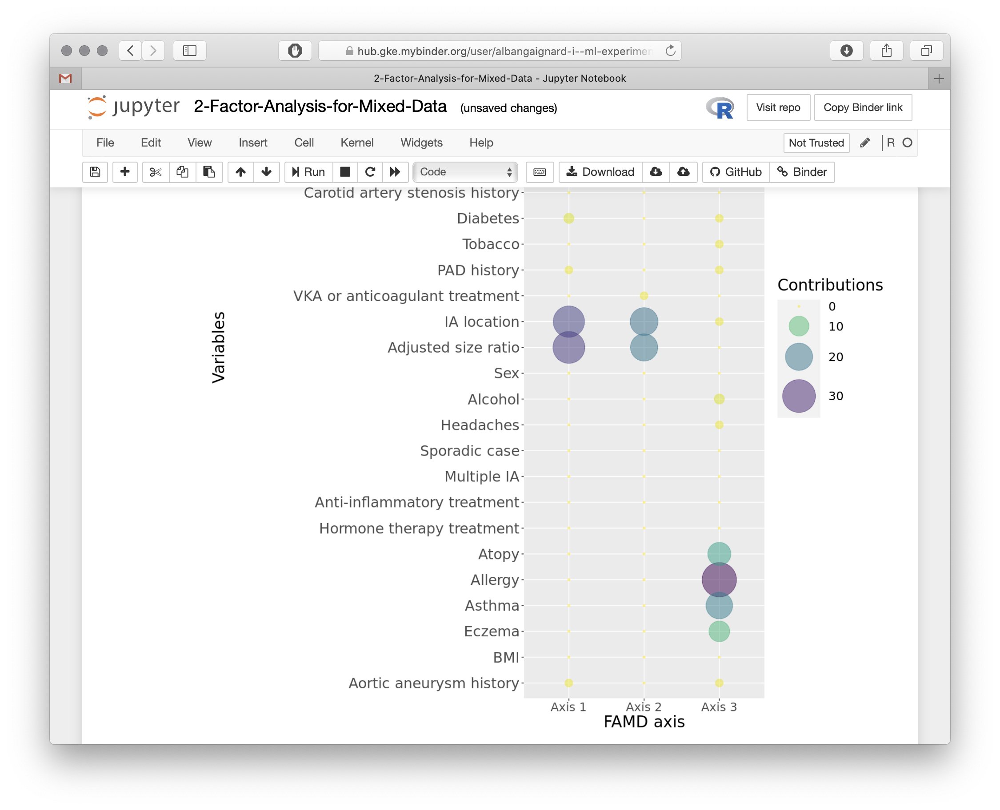
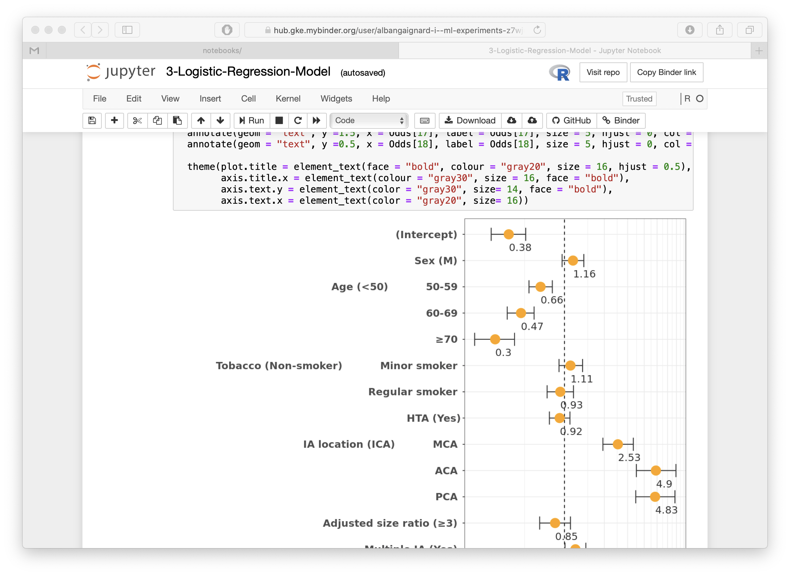
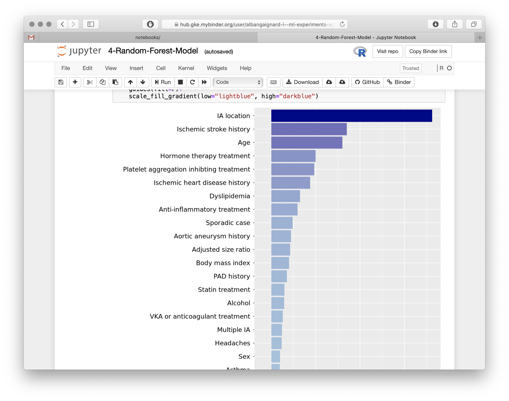
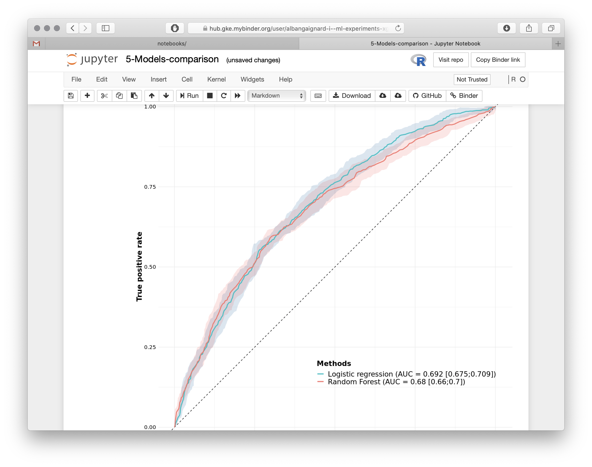

# Predicting and understanding intracranial aneurysm rupture events

## Motivations
ICAN (https://doi.org/10.1093/neuros/nyw135) is a French research program aimed at better understanding the pathophysiology of intracranial aneurysm (IA). One of the addressed challenges is to develop diagnostic and predictive tools addressing IA rupture risk. **For computational reproducibility, we provide here a simulated clinical dataset tooled with Python and R notebooks. 

**Contacts**
  - Olivia Rousseau, olivia.rousseau@univ-nantes.fr
  - Matilde Karakachoff, matilde.karakachoff@chu-nantes.fr
  - Alban Gaignard, alban.gaignard@univ-nantes.fr

## Online re-execution of data analysis and prediction pipeline 
We are gratefull to the [MyBinder](https://mybinder.org) service. It allows to launch and configure virtual machines with the required software environment. Dependencies are specified in the [environment.yml](binder/environment.yml) file. You can then interact with data analyis pipelines made available through jupyter notebooks . 

  1. Clinical data simulator: shows how we produce simulated data. Numpy random functions are extensively used to mimic virtual subjects with probablity distributions close to whats is observed in the real ICAN data collection. Explored varaibles are detailed in [sim-data.md](sim-data.md) . 
  1. Baseline characteristics: shows how variables are represented in the *ruptured* and *unruptured* sub-populations and hwo *p-values* are computed. . 
  1. Factor analysis (mixed data): shows how the FAMD dimensionality reduction method is applied to our dataset. 
  1. Logistic regression 
  1. Random forests 
  1. Predictive models comparison 

# Local re-execution
We also provider a Docker container hosting the packaged software environment and the jupyter notebooks. 

As soon as [docker is installed](https://docs.docker.com/get-docker/), launch the command `docker pull albangaignard/ican-ml` to retrieve the container, and `docker run -p 8888:8888 -i -t albangaignard/ican-ml` to run it. This will launch a jupyter notebook on your local computer on port 8888. Finally just browse the url specified in the terminal to enter into the notebook environment.

